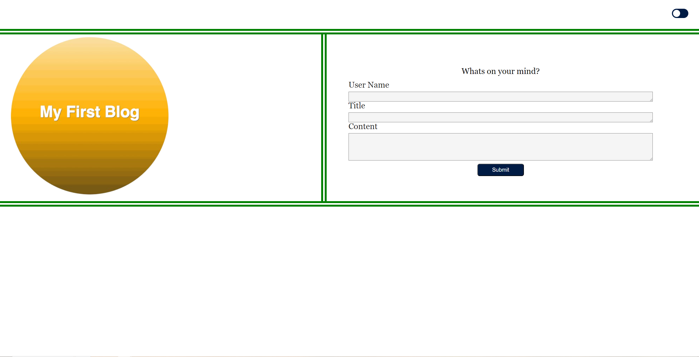
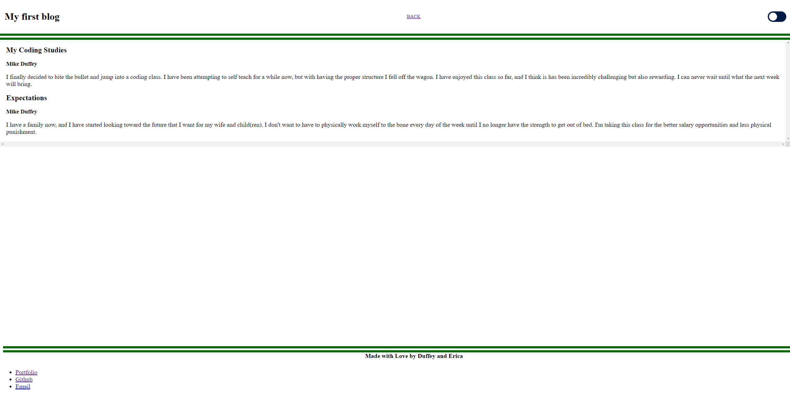

# Marketing Blog 

## **Scope of work**

**_The objective here was to create a simplistic blog for a user to enter information and then see a list of their post on the following page_**

**HTML**

- Created two separate .html files to handle the two difference pages where one would be the home page and display the form required to fill out, "User Name", "Title", and "Content." The other to display the stored post

- Both pages would have similar element structure

- Both pages have light/dark mode functionality

**CSS**

- Copied and paste for both index.css and blog.css for the most part. 

- index.css mainly carries the form attributes

- blog.css mainly carries the inputs from JS functionality to display the post

**JavaScript**

- There are three .js files: "form.js", "blog,js", and "logic.js"

- form.js carries the logic for the home page and stores the input array into local storage

- blog.js carries the logic for the blog post page and calls out and displays the information out of local storage

- logic.js carries logic used by both form and blog

- I also created a "Form Validation" function to pop an alert if any of the fields were left blank

[Marketing Blog](https://mtduffey36.github.io/marketing-blog/)

## **Collaboration**

- Made within partnership with [Erica Acosta](https://github.com/Ejacosta86)